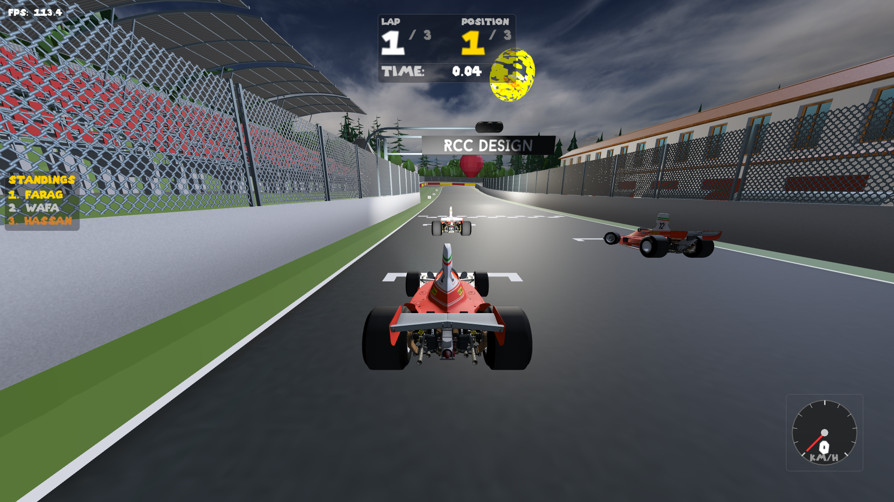
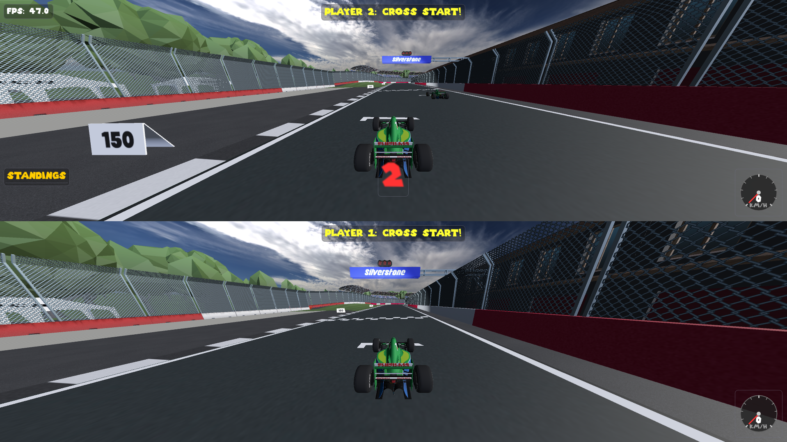
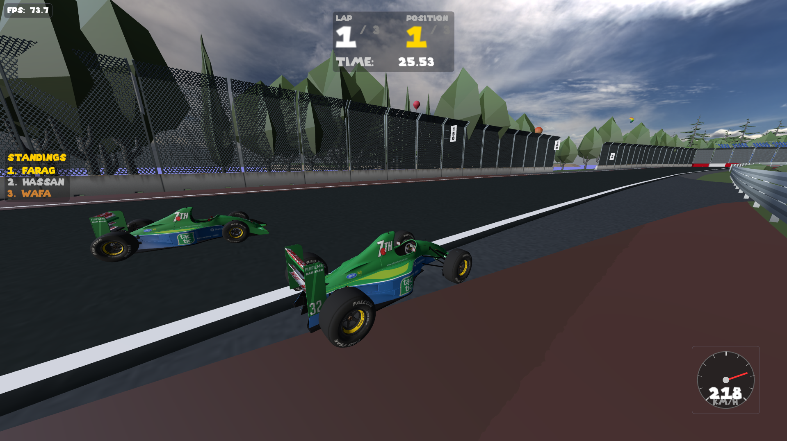

# Super Awesome Formula Game

### 🐧 Linux (Fedora/DNF) Installation

Run the following command to install the game:

```bash
sudo dnf install https://github.com/Youssefwafa7/super-awesome-formula-game/releases/download/v1/super-awesome-formula-game-1.0-1.fc43.x86_64.rpm
```

### 📥 Manual Download

Download this folder and run the executable to play the game:

https://drive.google.com/drive/folders/1ksuXdJ4A73SVjLVRluYE-Bz5xrlXAsIb?usp=drive_link

## 🏎️ Game Description

**Super Awesome Formula Game** is a high-octane, 3D racing simulator built from the ground up using a custom C++ graphics engine and OpenGL. Experience the thrill of driving iconic Formula 1 cars, including the legendary **1975 Ferrari 312T** and the **1991 Ferrari 643**, across world-class circuits.

### Key Features

- **Realistic Racing Mechanics**: Advanced car controller with acceleration, braking, and terrain-specific handling (asphalt vs. grass).
- **Iconic Tracks**: Race on detailed recreations of **Silverstone**, **Montreal**, and **Spa-Francorchamps**.
- **Multiplayer**: Compete with friends in local **Split-Screen** mode.
- **Advanced Graphics**: Custom-built forward renderer featuring:
  - Dynamic lighting (Point, Directional, and Spot lights).
  - Physically-based materials (Albedo, Specular, Roughness).
  - Atmospheric effects including Sky Spheres and Fog.
  - Post-processing pipeline (Chromatic Aberration, Vignette, and more).

---

## 📸 Screenshots


_Welcome to the Super Awesome Formula Game_


_Intense local multiplayer racing_


_Experience iconic tracks in stunning detail_

---

## 🚀 How to Run

### Prerequisites

- **C++17 Compiler**: GCC 9+, Clang 5+, or Visual Studio 2017+.
- **CMake**: Version 3.10 or higher.
- **OpenGL**: 3.3 or higher.

### Building from Source

1.  **Clone the repository**:
    ```bash
    git clone https://github.com/Youssefwafa7/super-awesome-formula-game.git
    cd super-awesome-formula-game
    ```
2.  **Initialize Git LFS** (Required to download the 3D models):
    ```bash
    git lfs install
    git lfs pull
    ```
3.  **Generate build files**:
    ```bash
    cmake -B build
    ```
4.  **Compile the project**:
    ```bash
    cmake --build build
    ```

### Running the Game

Once compiled, you can find the executable in the `bin` folder. Run it from the project root:

**On Linux:**

```bash
./bin/GAME_APPLICATION
```

**On Windows:**

```bash
.\bin\GAME_APPLICATION.exe
```

_Optional: Use the `-c` flag to specify a custom configuration file:_

```bash
./bin/GAME_APPLICATION -c='config/app.jsonc'
```

---

## 🎮 Controls

- **W / S (or Up/Down Arrows)**: Accelerate / Brake (Reverse)
- **A / D (or Left/Right Arrows)**: Steering
- **Esc**: Return to Menu/Pause
